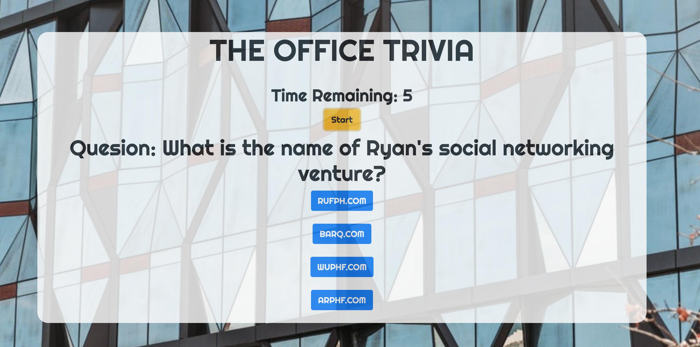

## THE OFFICE TRIVIA GAME 

## DESCRIPTION 
    This is a game that asks trivia questions about The Office TV Show. The player gets 10 seconds to answer each question before the next question is displayed. If player does not choose an answer, the answer is marked wrong and the next question is displayed. After all the questions are displayed, the number of correct and wrong answers are displayed. The Office theme songs plays when the page loads. 

## SITE 

## TECHNOLOGIES USED 
    * HTML 
    * CSS
    * JavaScript 
        * jQuery
    * [Bootstrap](https://getbootstrap.com) 

## SKILLS LEARNED 
    * Using jQuery timers and intervals 

## AUTHORS 
    * [Megha Bindiganavale](https://github.com/meghabprasad)     

    